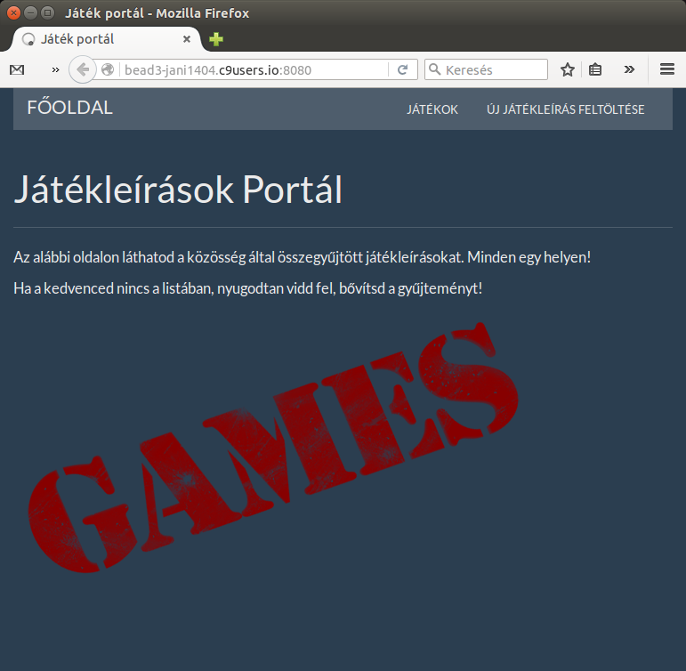

# Alkalmazások fejlesztése
ALKALMAZÁS: Játékok rövid ismertetésére szolgáló portál

NÉV: Balog János  
NEPTUN: QFYA09

### A feladat leírása

Egy webes vastagkliens, azaz egyoldalas alkalmazás készítése Ember.js segítségével.
A feladatnak minimálisan tartalmaznia kell:

-legalább két modellt, egy-sok kapcsolatban
-legalább 1 űrlapot
-legalább 1 listázó oldalt
-legyen lehetőség új felvételére
-legyen lehetőség meglévő szerkesztésére
-legyen lehetőség meglévő törlésére
-REST API végpont kialakítása
-szerveroldali perzisztálás fájlba

### Nem funkcionális követelmények

A fejlesztéshez szükséges hardver:
- CPU: Pentium 4 (vagy annál újabb)
- RAM: 1 GB (vagy annál több)
- Felbontás: 1024x768

A fejlesztéshez használt szoftverek:
- Operációs rendszer: Ubuntu Linux 14.04.3 LTS
- Követelmény elemzés és fejlesztőeszköz: c9.io

A futtatáshoz szükséges szoftverek:
- Tetszőleges operációs rendszer grafikus felülettel
- Javascript futtatására alkalmas böngésző (pl. Firefox)

A futtatáshoz szükséges minimum hardver:
- CPU: Pentium 4 (vagy annál újabb)
- RAM: 512 MB
- Felbontás: 800x600

A futtatáshoz szükséges ajánlott hardver:
- CPU: Pentium 4 (vagy annál újabb)
- RAM: 2048 MB
- Felbontás: 1024x768

### Egyéb követelmények:

- Interaktív felhasználói felület, könnyű kezelhetőség,

### Választott feladat

Egy játékleírásokat tartalmazó oldalt hoztam létre, ahová bárki felviheti a kedvenc játéka címét és annak rövid ismertetőjét. E webes alkalmazás segítségével sokan ismerhetnek meg olyan videojátékokat, melyekről még nem is hallottak.

### Futtatás

Githubról le kell tölteni a projektet, majd importáljuk cloud9 -be, miután létrehoztunk az alkalmazásnak egy új projektet. Fontos, hogy restapival is rendelkezzünk kell, amit egy másik projektben kell tárolni, ez lesz a szerver.

Miután elindítottuk a szervert már csak a projektet kell elindítani, amit a következő parancs begépelésével tudunk megtenni:  ' ./node_modules/ember-cli/bin/ember server '

### Használati útmutató

Az oldalra navigálva a felhasználó a főoldalon találja magát. Jobb felső sarokban megtudja tekinteni a felvitt játékok leírását, de lehetősége van újat is hozzáadni.
Lehetőség van a játék adatait megtekinteni, szerkeszteni és törölni is. Ezekre külön gomb van elhelyezve az oldalon. 
Az új játékleírás felvétele roppant egyszerűen zajlik. Egy legördülő menü segítségével választhatjuk ki, hogy a felvinni kívánt játék milyen kategóriába tartozik, majd a nevet és az ismertetőt is meg kell adni, enélkül az oldal nem is enged semmit sem feltölteni.

### Az oldal felépítése

### Végpontok

- Főoldal: http://bead3-jani1404.c9users.io/
- Elérhető játékleírások listája: http://bead3-jani1404.c9users.io/games/list
- Új játékleírás hozzáadása: http://bead3-jani1404.c9users.io/games/new

### Adatbázismodell

Hozzáadás dátuma, Kategória, Név és leírás

### Szerepkörök

Az oldal látogatói tulajdonképpen minden adathoz hozzáférhetnek. Így egyetlen szerepkör van és hozzájuk kapcsolódhat sok játékleírás. 

### Könyvtárszerkezet

>.
├── app
|	├── components
|	├── controllers
|	├── helpers
|	├── models
|	├── pods
|	│   ├── application
|	│   ├── components
|	│   │   ├── error-detail
|	│   │   ├── error-list
|	│   │   └── new-error-form
|	│   ├── error
|	│   ├── games
|	│   │   ├── edit
|	│   │   ├── list
|	│   │   ├── new
|	│   │   └── view
|	│   └── index
|	├── routes
|	├── styles
|	└── templates
|		└── components
|
├── bower_components
├── config
├── dist
├── docs
├── node_modules
├── public
├── tests
├── tmp
└── vendor
